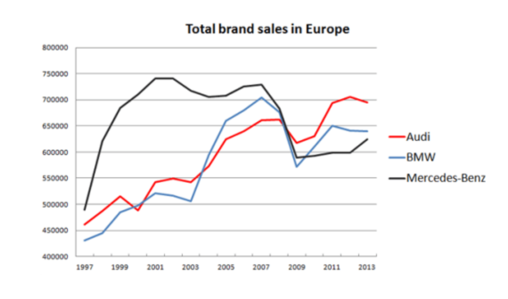
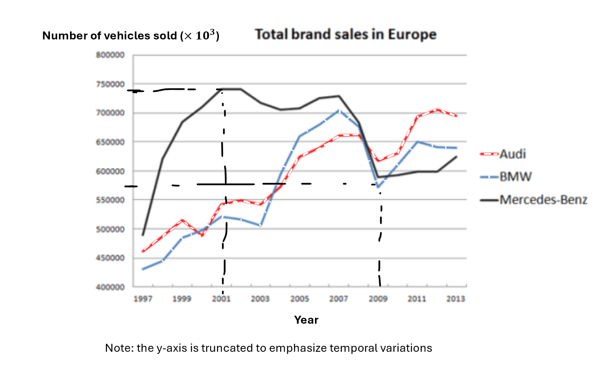
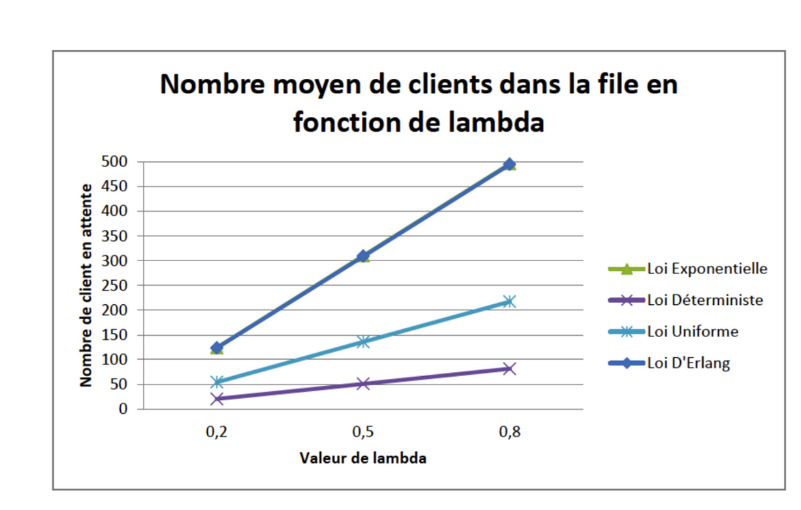
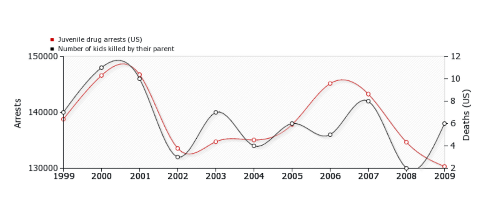
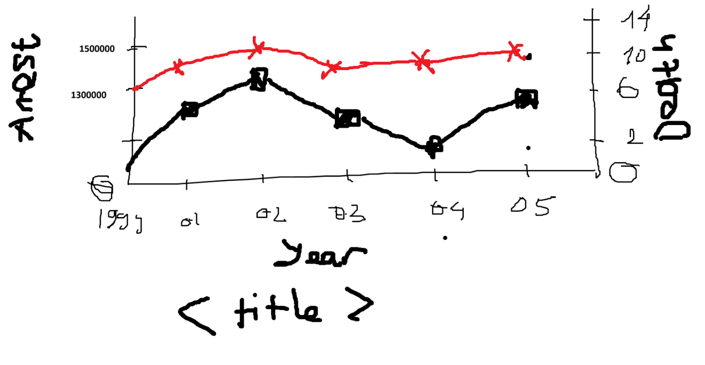

### Graphic 1

**Issues:**

- Missing units. The y-axis does not indicate which metric is being represented (number of cars sold, total revenue, etc.).

- Using the same line style for all three legends can make it hard to read, especially in black-and-white prints.

- Missing explanation for why the origin is not at (0, 0).

**Improvements:**

### Graphic 2

**Issues:**

- The x-axis is continuous, but too few points are plotted, making the two lines appear to overlap and hard to distinguish → suggest plotting more points.

- The x-axis label is unclear; it only shows “value of lambda” → label the x-axis properly and mention lambda only in the legend.

- Missing confidence intervals when plotting mean values → add error bars.

**Improvements:**

### Graphic 3

**Issues:**

- The y-axis origin is not at 0, and truncation is inappropriate for the two variables → can give a misleading impression of variation → may suggest a false correlation → adjust the axis to start at 0 and ensure proper scaling between intervals.

- Missing title.

- Using a smoothing method on discrete data is inappropriate → connect the points with straight lines instead.

**Improvements: (It doesn't look quite good as I draw it on MS Paint :) But the idea is preserved)**

